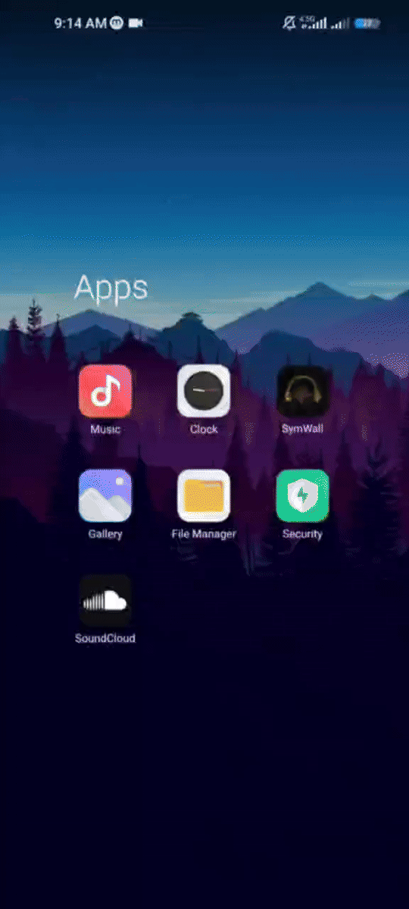
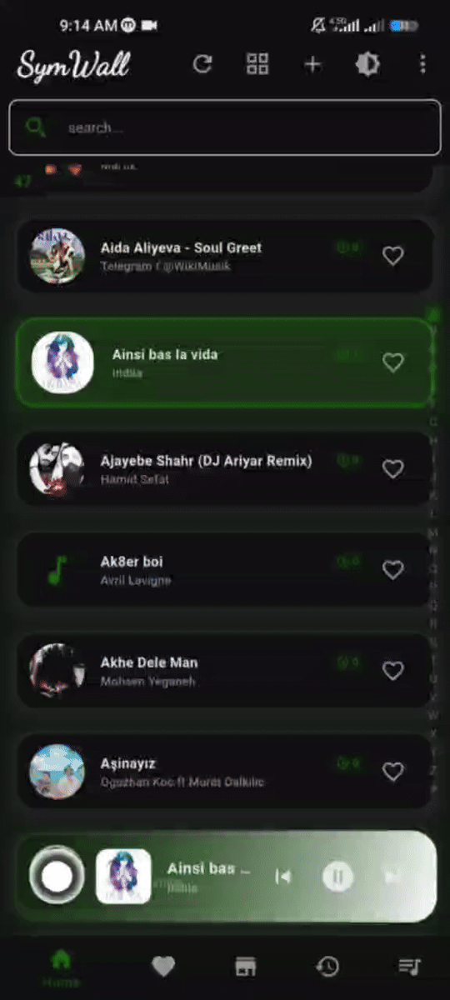

# MusicPlayer# 🎵 SymWall

SymWall is not just another music video app — it’s a new way to enjoy music visually.  
Built with Flutter on the frontend and powered by a solid Java backend, SymWall delivers a smooth, stylish, and dynamic experience.  

---

## ✨ Highlights
- Build and organize custom playlists effortlessly  
- Smart search based on most–played videos  
- A modern, minimal interface with smooth animations  
- Multiple themes to match your vibe  

---

## 📺 Walkthrough

### 1. Home Screen
  
Shows the app launching and the first main screen with latest music videos.

### 2. Local Music & Home
  
Displays the local music section alongside the main home screen.

### 3. Like Feature
  
Demonstrates how users can like a music video within the app.

### 4. Music Shop
  
Shows the Music Shop section where users can browse and explore new tracks.

### 5. Profile & User
  
Displays the user profile page with personal information and settings.

### 6. Themes
  
Demonstrates the different themes available for customizing the app’s appearance.

### 7. Recently Played
  
Shows the recently played music section where users can revisit their latest tracks.

### 8. Search
  
Demonstrates the search functionality to quickly find music videos within the app.

### 9. Alternative Layout
  
Shows a different display layout option for browsing music videos.

### 10. App Overview
  
Provides a quick walkthrough showing multiple sections of the app in action.

---

## 🛠 Stack
- Flutter (Frontend)  
- Java (Backend)  

---

## 📄 License
Released under the MIT License — free for everyone to use and improve.
